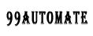
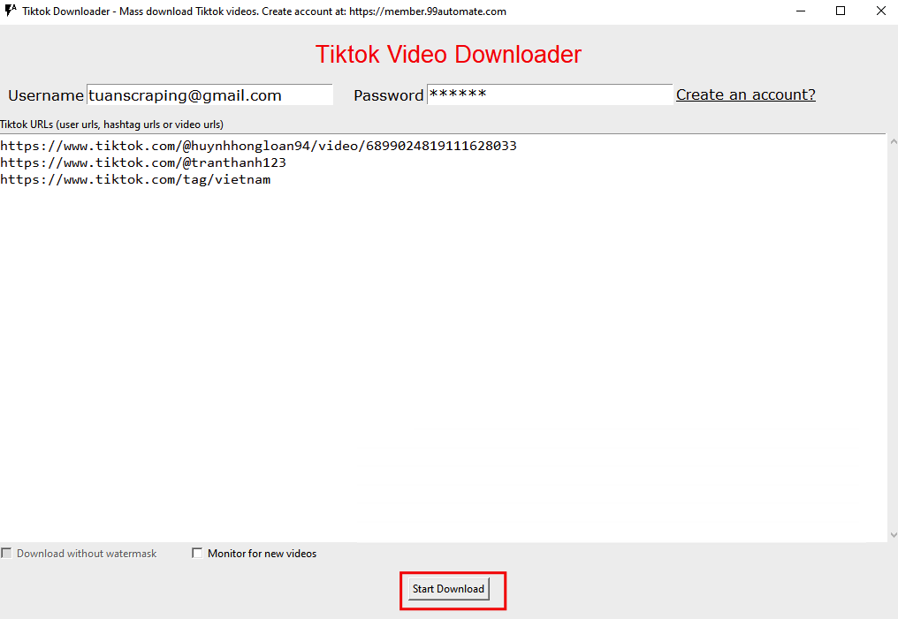

<!-- PROJECT LOGO -->
 

  

  <h3 align="center">99automate - Tiktok Downloader</h3>

  

    Tiktok Downloader - A program from 99automate.com
     
    <a href="https://github.com/etuannv/Tiktok-Mass-Download"><strong>Explore the docs »</strong></a>
     
     
    <a href="https://github.com/etuannv/Tiktok-Mass-Download">View Demo</a>
    ·
    <a href="https://github.com/etuannv/Tiktok-Mass-Download/issues">Report Bug</a>
    ·
    <a href="https://github.com/etuannv/Tiktok-Mass-Download/issues">Request Feature</a>
  

<!-- ABOUT THE PROJECT -->
## About The Project

Tiktok Downloader is one program that provided by 99automate. It allows to mass download videos from Tiktok

<!-- GETTING STARTED -->
## Getting Started

This is a standalone program for Windows. We just download the program and run it without installation

### Prerequisites

* A Windows machine
  

### Download

1. Download the program at [https://member.99automate.com/static/downloads/tiktok-downloader-windows.zip](https://member.99automate.com/static/downloads/tiktok-downloader-windows.zip) or this repository
2. Extract the zip file
3. Click to run the program

<!-- USAGE EXAMPLES -->
## Usage

1. Register an account at [https://member.99automate.com/register/](https://member.99automate.com/register/)
2. Check your register email to activate your account
3. Run the program
4. Enter information
– Enter your email, password
– Enter Tiktok links: video, hashtag, users URLs
– Click “Start Download” button
[https://etuannv.com/wp-content/uploads/2020/05/run-downloader.png](https://etuannv.com/wp-content/uploads/2020/05/run-downloader.png)

<!-- ROADMAP -->
## Roadmap

See the [open issues](https://github.com/etuannv/Tiktok-Mass-Download/issues) for a list of proposed features (and known issues).

<!-- CONTACT -->
## Contact

Email: 99automate@gmail.com

Project Link: [https://member.99automate.com](https://member.99automate.com)

<!-- MARKDOWN LINKS & IMAGES -->
<!-- https://www.markdownguide.org/basic-syntax/#reference-style-links -->
[contributors-shield]: https://img.shields.io/github/contributors/othneildrew/Best-README-Template.svg?style=for-the-badge
[contributors-url]: https://github.com/etuannv/Tiktok-Mass-Download/graphs/contributors
[forks-shield]: https://img.shields.io/github/forks/othneildrew/Best-README-Template.svg?style=for-the-badge
[forks-url]: https://github.com/etuannv/Tiktok-Mass-Download/network/members
[stars-shield]: https://img.shields.io/github/stars/othneildrew/Best-README-Template.svg?style=for-the-badge
[stars-url]: https://github.com/etuannv/Tiktok-Mass-Download/stargazers
[issues-shield]: https://img.shields.io/github/issues/othneildrew/Best-README-Template.svg?style=for-the-badge
[issues-url]: https://github.com/etuannv/Tiktok-Mass-Download/issues
[license-shield]: https://img.shields.io/github/license/othneildrew/Best-README-Template.svg?style=for-the-badge
[license-url]: https://github.com/etuannv/Tiktok-Mass-Download/blob/master/LICENSE.txt
[linkedin-shield]: https://img.shields.io/badge/-LinkedIn-black.svg?style=for-the-badge&logo=linkedin&colorB=555
[linkedin-url]: https://linkedin.com/in/othneildrew
[product-screenshot]: run-downloader.png
